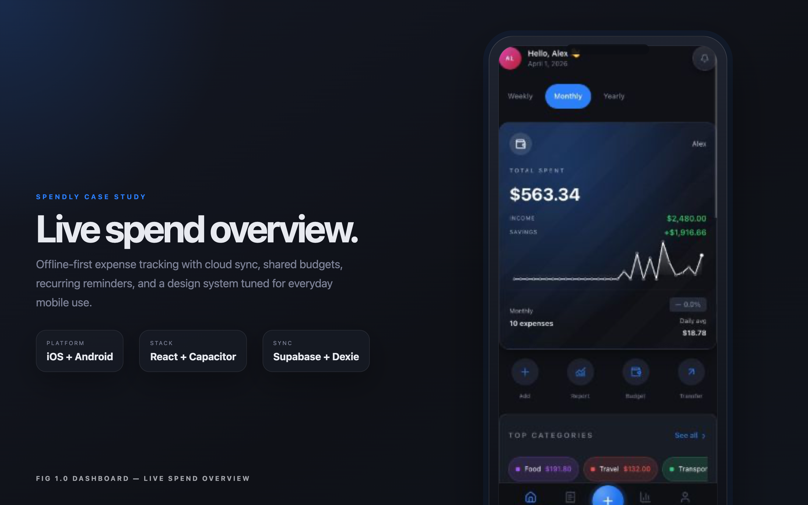
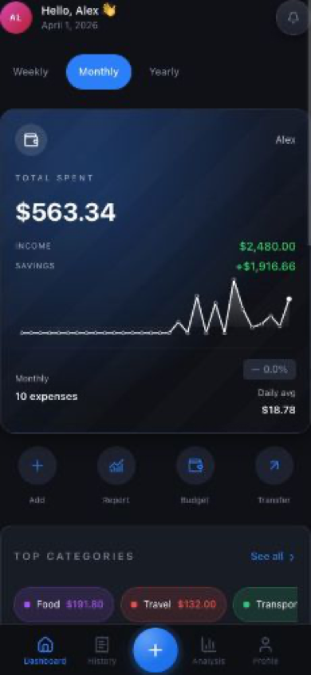
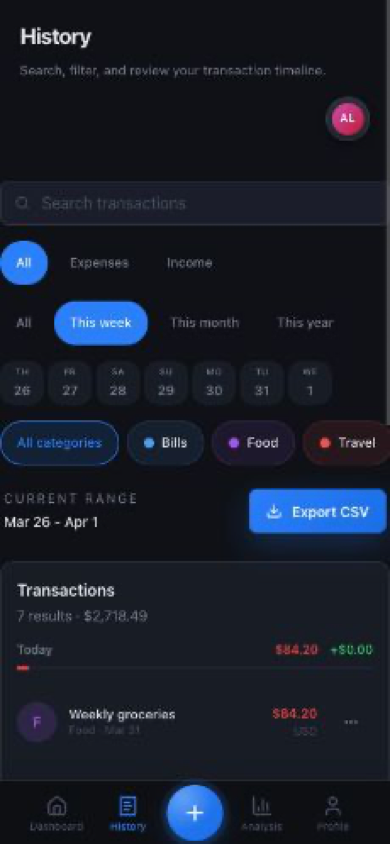
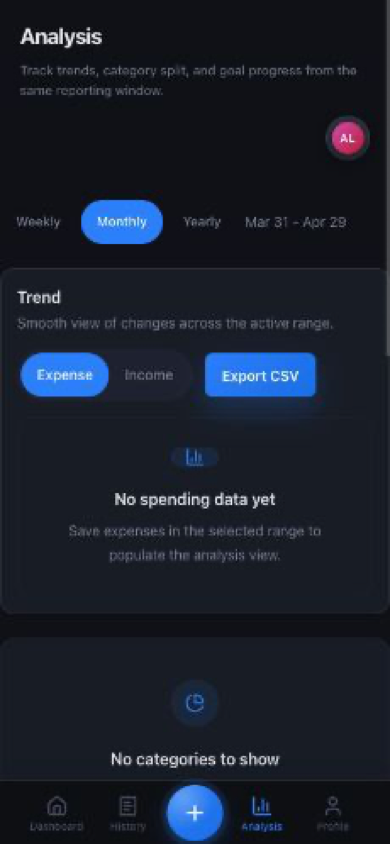
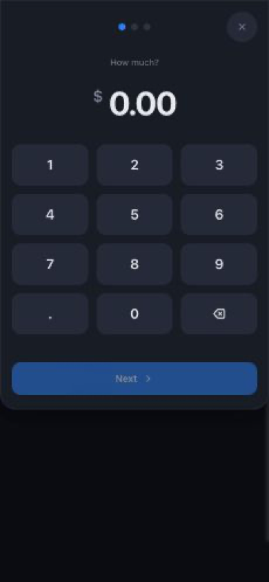
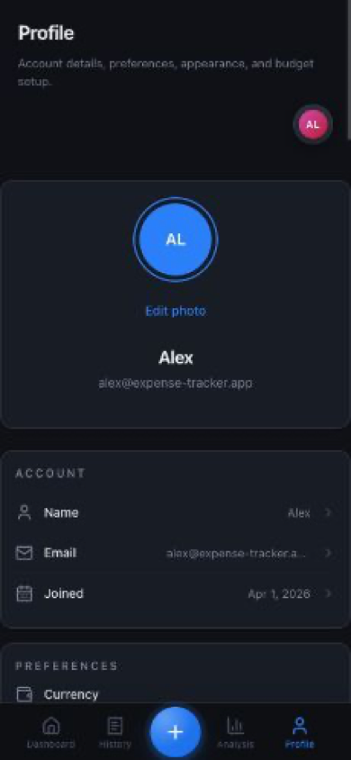
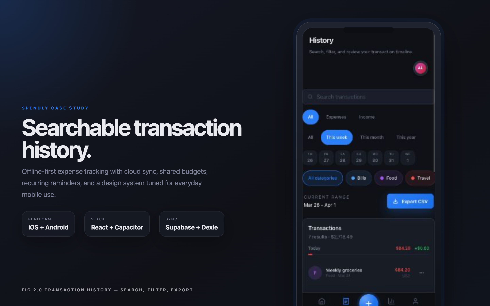

# 

<div align="center">

# 💎 Spendly
**The Ultimate Full-Stack, Offline-First Financial Intelligence Platform**

[](https://react.dev/)
[](https://www.typescriptlang.org/)
[](https://supabase.com/)
[](https://capacitorjs.com/)
[](LICENSE)

---

**Spendly** is a premium, offline-first fintech app built with React 19, Supabase, and Capacitor. It offers seamless cloud sync, IndexedDB caching, and high-fidelity animations. Track expenses, manage budgets, and monitor recurring bills across iOS, Android, and Web with native-grade performance and a stunning, modern UI designed for power users.

[**Explore the Code**](https://github.com/PRAFULREDDYM/EXPENSE_TRACKER) • [**Setup Guide**](docs/SUPABASE_SETUP.md) • [**Mobile Deployment**](docs/MOBILE_DEPLOYMENT.md)

</div>

---

## ✨ Key Features

### 📡 Offline-First & Real-Time Sync
Built with a "Cloud-Hybrid" architecture, Spendly uses **Dexie (IndexedDB)** for instantaneous local feedback and **Supabase (PostgreSQL)** for long-term cloud durability. Your data is always available, even without an internet connection.

### 📱 Cross-Platform Excellence
A single codebase deployed as a **PWA**, **Native iOS**, and **Native Android** app. Optimized for mobile haptics, status bar styling, and native keyboard interactions.

### 📊 Intelligent Insights
Visual analysis of your spending habits. Group expenses by category, track your budget progress in real-time, and get smart reminders for recurring bills.

<div align="center">
  
</div>

---

## 📸 App Showcase

<div align="center">
  <table border="0">
    <tr>
      <td align="center">
        <br />
        <b>Dashboard</b>
      </td>
      <td align="center">
        <br />
        <b>History</b>
      </td>
      <td align="center">
        <br />
        <b>Analysis</b>
      </td>
    </tr>
    <tr>
      <td align="center">
        <br />
        <b>Quick Add</b>
      </td>
      <td align="center">
        <br />
        <b>Pro User Profile</b>
      </td>
      <td align="center">
        <br />
        <b>Desktop Layout</b>
      </td>
    </tr>
  </table>
</div>

---

## 🛠 Tech Stack

| Layer | Technologies |
| :--- | :--- |
| **Frontend** | React 19, Vite, TypeScript, TanStack Query |
| **Backend** | Supabase (Database, Auth, Storage, Edge Functions) |
| **Mobile** | Capacitor 8.0, Haptics, Local Notifications |
| **Offline DB** | Dexie.js (IndexedDB wrapper) |
| **Animations** | Framer Motion, Motion One |
| **Styling** | Tailwind CSS 4.0, Lucide Icons |
| **Validation** | Zod, TypeScript Type Guards |

---

## 🚀 Getting Started

### Prerequisites
- **Node.js** (v20+)
- **NPM** or **Yarn**

### Local Installation
1.  **Clone the repository**:
    ```bash
    git clone https://github.com/yourusername/spendly.git
    cd spendly
    ```
2.  **Install dependencies**:
    ```bash
    npm install
    ```
3.  **Set up Environment Variables**:
    Create a `.env` file based on `.env.example` and add your **Supabase URL** and **Anon Key**.
4.  **Run Development Server**:
    ```bash
    npm run dev
    ```

### 📱 Native Deployment
Check out the [**Mobile Deployment Guide**](docs/MOBILE_DEPLOYMENT.md) for detailed instructions on building for iOS and Android using Capacitor.

---

## 🏗 Architecture

Spendly follows a modern **Serverless + Offline-First** architectural pattern:

1.  **UI Core**: React 19 handles the reactive render cycle.
2.  **Server State**: `useQuery` and `useMutation` (TanStack Query) manage data fetching from Supabase.
3.  **Local Sync Engine**: A custom sync layer ensures that every write is saved to **IndexedDB** immediately and queued for background sync to Supabase when a connection is available.
4.  **Security**: Native Supabase Auth integration for secure user sessions and row-level security (RLS) in the database.

---

<div align="center">
  <sub>Built by Praful Reddy</sub>
</div>

